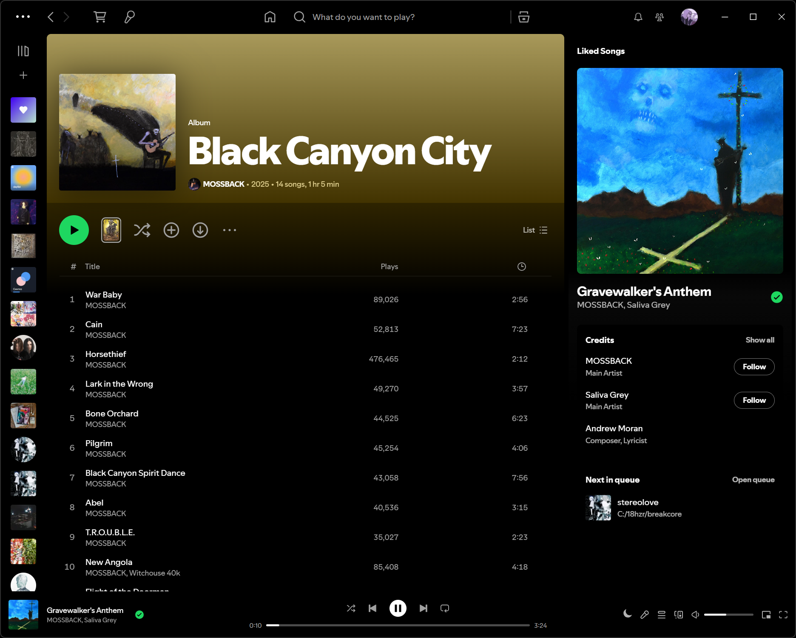
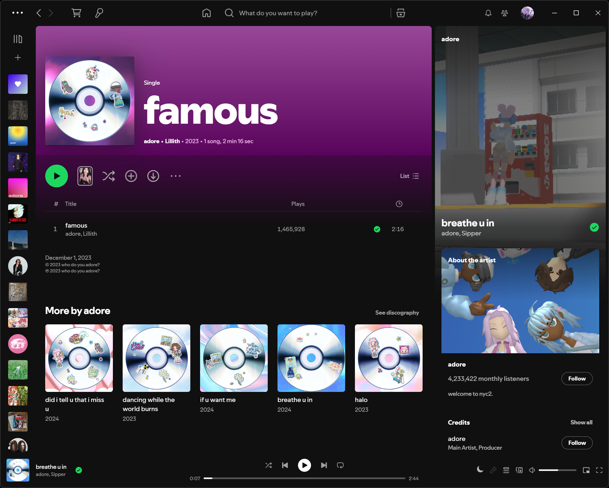
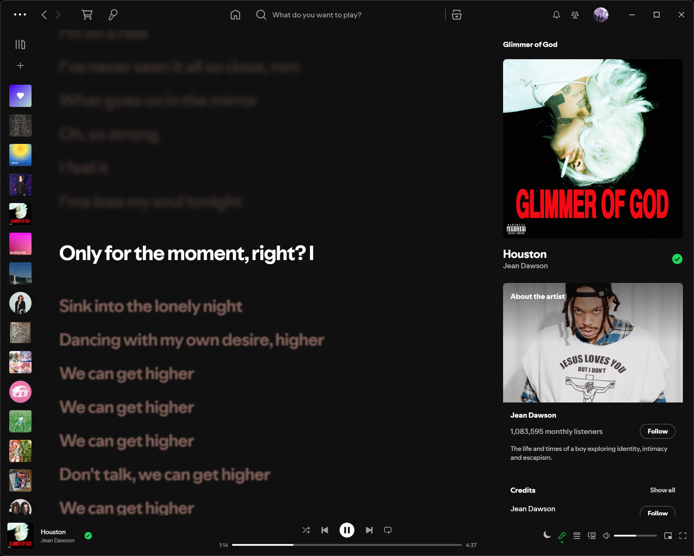
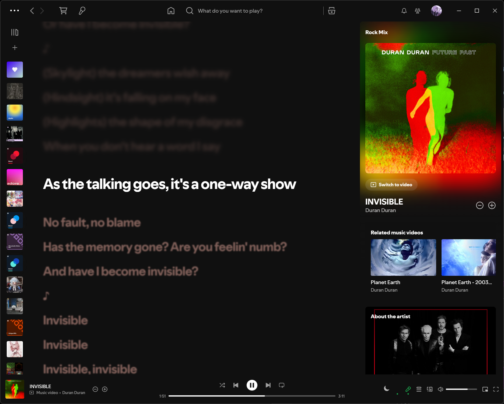

# Simply darker!
Very lightweight theme
_**NOW** - with cool lyrics_ 😼 (thanks for idea: 'Better Lyrics style' snippet)

Default font + bring back gradients! Accent is now again Spotify green, you can always change it via marketplace theme editor :|

### _And little more_
Some strings commented out in `user.css`: *remove gradients?* *change font?* or maybe *center lyrics?* or even *hide ugly background under window control buttons?* - **Do it!**  

## Preview
### Black

### Dark

### With NPV Ambience extension

Originally based on @bdsqqq's Port of the [Vesper VSCode theme](https://github.com/raunofreiberg/vesper/tree/main): [Vesper](https://github.com/bdsqqq/spicetify-vesper-theme) ❤️

For usage with Spicetify.
