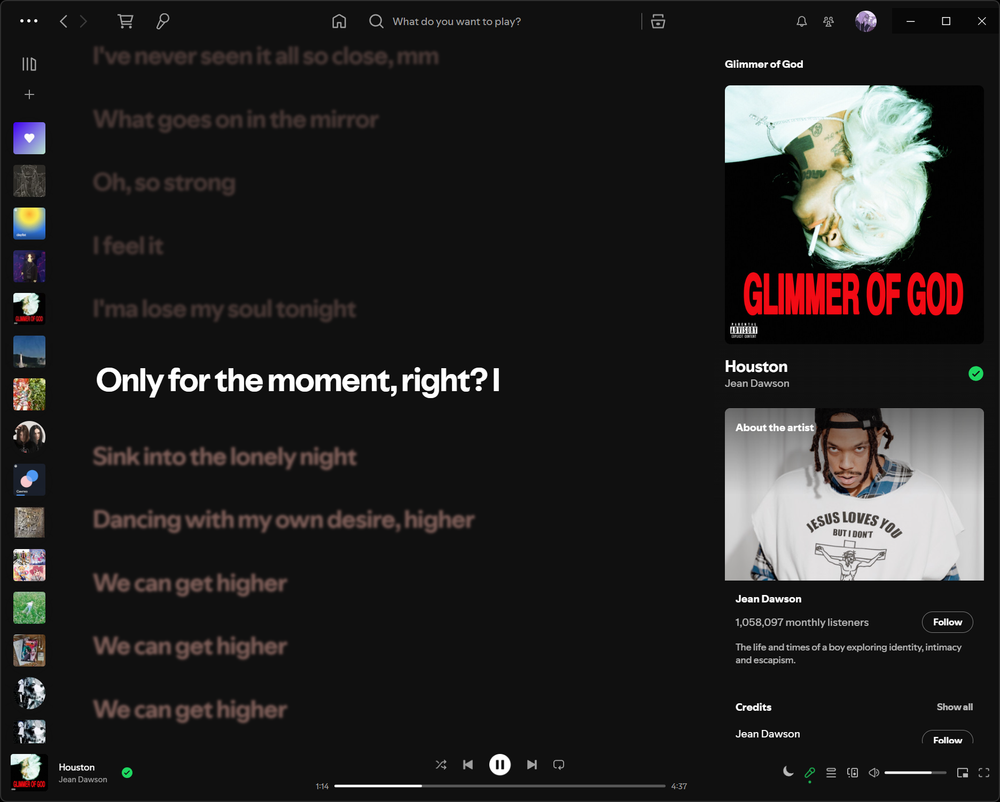

# Simply darker! (edited Vesper)
Default font + bring back gradients! Accent is now again Spotify green, u can always change it via marketplace theme editor :|

# Preview

Based on @bdsqqq's Port of the [Vesper VSCode theme](https://github.com/raunofreiberg/vesper/tree/main): [Vesper](https://github.com/bdsqqq/spicetify-vesper-theme)
For usage with Spicetify.